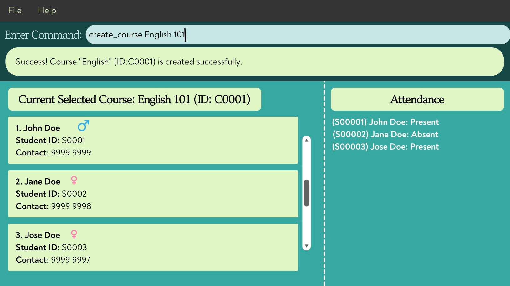

# EduBase User Guide

EduBase is a **desktop app for private tuition center owners to manage growing student enrollment and multiple classes, optimized for use via a Command Line Interface** (CLI). If you've recently scaled up from teaching a few students to running a full tuition center with dozens of classes and hundreds of students, EduBase helps you stay organized without expensive management software. If you can type fast, EduBase can get your administrative tasks done faster than traditional GUI apps or spreadsheets.
<page-nav-print />

**Why EduBase for Tuition Centers?**
As a tuition center owner managing multiple classes solo, you need fast access to:
- Which students are enrolled in each class
- Contact numbers for quick communication
- Course schedules and enrollment numbers
- Student registration details

EduBase lets you handle all of this through quick keyboard commands—no need to navigate through multiple menus or maintain complex spreadsheets.
--------------------------------------------------------------------------------------------------------------------

## Quick start

1. Ensure you have Java `17` or above installed in your Computer.
   **Mac users:** Ensure you have the precise JDK version prescribed [here](https://se-education.org/guides/tutorials/javaInstallationMac.html).

1. Download the latest `.jar` file from [here](https://github.com/AY2526S1-CS2103T-T13-4/tp/releases).

1. Copy the file to the folder you want to use as the _home folder_ for your application.

1. Open a command terminal, `cd` into the folder you put the jar file in, and use the `java -jar edubase.jar` command to run the application.
   A GUI similar to the below should appear in a few seconds. Note how the app contains some sample data.
   

1. Type the command in the command box and press Enter to execute it. e.g. typing **`help`** and pressing Enter will open the help window.
   Some example commands you can try:

* `list` : Shows all students and courses.

* `create_course n/English 101 id/C0001` : Creates a new course named "English 101" with course ID 'C0001'.

* `register n/John Doe g/Male p/98765432` : Registers a new student.

* `exit` : Exits the app.

1. Refer to the [Features](#features) below for details of each command.

--------------------------------------------------------------------------------------------------------------------

## Features

<box type="info" seamless>

**Notes about the command format:** 

* Words in `UPPER_CASE` are the parameters to be supplied by the user. 
  e.g. in `create_course n/<COURSE_NAME> id/<COURSE_ID>`, `COURSE_NAME` and `COURSE_ID` are parameters which can be used as `create_course n/ English 101 id/ C0001`.

* Items in square brackets are optional. 

* Items with `…`​ after them can be used multiple times including zero times. 

* Parameters can be in any order for commands using flags (e.g., `n/`, `g/`, `d/`). 
  e.g. for `register n/NAME g/GENDER p/PHONE`, `register g/GENDER n/NAME p/PHONE` is also acceptable.

* Extraneous parameters for commands that do not take in parameters (such as `view_courses`, `exit`, and `list`) will be ignored.

* If you are using a PDF version of this document, be careful when copying and pasting commands that span multiple lines as space characters surrounding line-breaks may be omitted when copied over to the application.
  </box>

### General Application Commands

These commands control the application itself.

---

#### Viewing help : `help`

Shows a message explaining how to access the help page.

**Format:** `help`

---

#### Viewing All Students and Courses: `list`

Allows users to view a list of all existing courses and students.

**Format:** `list`

---

#### Clearing All Students and Courses: `clear`

Allows users to clear all data of existing courses and students.

**Format:** `clear`

--- 

#### Exiting the System: `exit`

Allows teachers to exit from the system using the command box.

**Format:** `exit`

---

### Course Management

These commands are for creating, viewing, and managing courses.

---

#### Creating a Course: `create_course`

Allows teachers to create a new course. Duplicate course names are allowed, but duplicate course ids are not allowed.

**Format:** `create_course n/<COURSE_NAME> id/<COURSE_ID>`

**Requirements:**
* Course Names can only include alphanumeric characters and spaces, and it should not be blank or more than 50 characters.
* `Course ID` must follow the correct format which is ‘C’ followed by 4 numeric digits. (e.g. `C0001`)
* `Course ID` cannot be used by other courses in the course list.

**Examples:**
* `create_course n/English 101 id/C0002`
* `create_course n/Calculus II id/C1231`

---

#### Viewing All Courses: `view_courses`

Allows users to view a list of all existing courses with their `Course ID`s.

**Format:** `view_courses`

**Example:**
* `view_courses`

---

#### Viewing Course Details: `view_course_details`

Allows teachers to view all courses details and all the students in that class.

**Format:** `view_course_details <COURSE_ID>`

**Examples:** `view_course_details C0001`

---

#### Find Course By Name: `find_course_by_name`

Finds and lists all courses whose names contain any of the given keywords.

**Format:** `find_course_by_name <COURSE_NAME>...`

**Requirements:**
* Names can only include alphanumeric characters and spaces.
* At least one name needs to be provided, and not blank.
* Matches are **case-insensitive**.
* A course will be listed if **any** of the provided keywords match part of its name.

<box type="tip" seamless>

**Tips:** 
* You can enter multiple keywords, separated by spaces. 
* For example, typing `find_course_by_name science english` will return all courses that contain either “science” or “english” in their names. 

</box>

**Examples:**
* `find_course_by_name English` → finds `English 101`, `Advanced English`.
* `find_course_by_name Science English` → finds all courses with either “Science” or “English” in their names.
* `find_course_by_name Math` → finds `Mathematics` (partial word matches are supported).

---

#### Edit Course: `edit_course`

Allows users to edit course id and course name by selecting its index in view list.

**Format:** `edit_course INDEX [n/<COURSE_NAME>] [id/<COURSE_ID>]`

**Requirements:**
* INDEX need to be the same as the index used in the displayed course list.
* `Course ID` must follow the correct format which is ‘C’ followed by 4 numeric digits. (e.g. `C0001`)
* `Course ID` cannot be used by other courses in the course list.
* At least one field (course name or course id) needs to be provided.

**Example:**
* `edit_course 1 n/English 101 id/C0001`

**Tips:**
* If the new data you enter is identical to the original data, the system will still process the action and display a success message.

---

#### Deleting a Course: `delete_course`

Allows teachers to delete an existing course using its unique `Course ID`.

**Format:** `delete_course <COURSE_ID>`

<box type="warning" seamless>

**Caution:** Ensure the `Course ID` is correct, as this action cannot be undone.

</box>

**Examples:**
* `delete_course C0001`

---

### Student Management

These commands are for registering, viewing, and managing students in the main database.

---

#### Registering a New Student: `register`

Allows teachers to add a new student to the EB database. A unique `Student ID` (e.g., S00001) is automatically assigned.

**Format:** `register n/<NAME> p/<PHONE> g/<GENDER>`

**Requirements:**
* `Name` can only include alphanumeric characters and spaces, and it should not be blank or more than 50 characters.
* `Phone` numbers can only include numbers from 3 to 20 digits.
* `Gender` can only accept values of `Male`, `Female`, and `Other`.

<box type="tip" seamless>

**Tips:** 
* Duplicate names are allowed but will receive a new unique `Student ID`. 
* Names are case-sensitive. 
* Genders are case-insensitive.

</box>

<box type="warning" seamless>

**Caution:**  
* You can register up to 99999 students into a system.
* Once the latest student id reaches S99999, you cannot add more students. 

</box>

**Examples:**
* `register n/John Doe p/12345678 g/Male`
* `register n/Jane Doe p/12345678 g/Female`

---

#### Find Student By ID: `find_student_by_id`

Allows users to find student by entering the `Student ID`.

**Format:** `find_student_by_id <STUDENT_ID>...`

**Requirements:**
* `Student ID` need to be in valid format, which is `S` followed by 5 digits (e.g., SXXXXX).
* At least one `Student ID` needs to be provided, and not blank.

<box type="tip" seamless>

**Tips:** 
* Multiple `Student ID`s are allowed, separated by space. 
* `Student ID` is case-sensitive. 

</box>

**Example:**
`find_student_by_id S00001 S00002`

---

#### Find Student By Name: `find_student_by_name`

Allows users to find student by entering the student name.

**Format:** `find_student_by_name <STUDENT_NAME>...`

**Requirements:**
* Names can only include alphanumeric characters and spaces.
* At least one name needs to be provided, and not blank.
* Matches are **case-insensitive**.
* A student will be listed if **any** of the provided keywords match part of its name.

<box type="tip" seamless>

**Tips:** 
* You can enter multiple keywords, separated by spaces. 
* For example, typing `find_student_by_name Jane Doe` will return all students that contain either “Jane” or “Doe” in their names. 

</box>

**Examples:**
* `find_student_by_name James` → finds `James Lee`, `James English`.
* `find_student_by_name James Low` → finds all students with either “James” or “Low” in their names.
* `find_student_by_name Matt` → finds `Matty` (partial word matches are supported).

---

#### Edit Student: `edit_student`

Allows users to edit student name, phone and gender by selecting its index in view list.

**Format:** `edit_student INDEX [n/<NAME>] [p/<PHONE>] [g/<GENDER>]`

**Requirements:**
* INDEX need to be the same as the index used in the displayed student list.
* Names can only include alphanumeric characters and spaces.
* Phone numbers can only include numbers from 3 to 20 digits.
* Genders can only accept values of `Male`, `Female`, and `Other`.
* At least one field (Name, Phone or Gender) needs to be provided.

**Example:**
* `edit_student 1 n/John Doe p/1230499 g/Male`

**Tips:**
* If the new data you enter is identical to the original data, the system will still process the action and display a success message.

---

#### Deregistering a Student: `deregister`

Allows teachers to permanently delete a student from the EB database using their unique `Student ID`.

**Format:** `deregister <STUDENT_ID>`

**Requirements:**
* `Student ID` must follow the correct format which is ‘S’ followed by 5 numeric digits. (e.g. `S00001`)
* The target student exists in the EB database.
* The target student is not enrolled in either of the courses.

**Examples:**
* `deregister S00001`

---

### Enrollment Management

These commands manage the relationship between students and courses.

---

#### Adding Student to Course: `add_student`

Allows teachers to enroll an already-registered student into a course using `Student ID` and `Course ID`.

**Format:** `add_student <STUDENT_ID> <COURSE_ID>`

**Requirements:**
* `Student ID` must follow the correct format which is ‘S’ followed by 5 numeric digits. (e.g. `S00001`)
* `Course ID` must follow the correct format which is ‘C’ followed by 4 numeric digits. (e.g. `C0001`)
* The target student exists in the EB database.
* The target course exists in the EB database.
* The target student is not enrolled in the target course.

<box type="tip" seamless>

**Tips:** A filter will be applied to view the students enrolled in that course.

</box>

<box type="warning" seamless>

**Caution:**  
* A student cannot be added to a course if they are already inside the course. 
* You can add up to 99999 students (max number of students allowed in EduBase) into a class.

</box>

**Examples:**
* `add_student S00001 C0001`

---

#### Removing Student from Course: `remove_student`

Allows teachers to unenroll a student from the currently entered course using `Student ID` and `Course ID`.

**Format:** `remove_student <STUDENT_ID> <COURSE_ID>`

**Requirements:**
* `Student ID` must follow the correct format which is ‘S’ followed by 5 numeric digits. (e.g. `S00001`)
* `Course ID` must follow the correct format which is ‘C’ followed by 4 numeric digits. (e.g. `C0001`)
* The target student exists in the EB database.
* The target course exists in the EB database.
* The target student is currently enrolled in the target course.

**Examples:**
* `remove_student S00001 C0001`

<box type="tip" seamless>

**Tips:** A filter will be applied to view the students enrolled in that course.

</box>

**Note:**
* If you want to find the `Student ID` or `Course ID`, use [`find_course_by_name`](#find-course-by-name-find_course_by_name) or [`find_student_by_name`](#find-student-by-name-find_student_by_name).

--------------------------------------------------------------------------------------------------------------------

## FAQ

**Q**: I am getting an "Invalid name" error when registering a student. 
**A**: **Names can only contain alphanumeric characters and spaces.** Ensure you are not using any special symbols.

**Q**: How do I know the ID of the course I just created? 
**A**: The `Course ID` is displayed immediately upon successful creation (e.g., `New course created: English; Course Id: C1231`). You can also use [`view_courses`](#viewing-all-courses-view_courses) to see a list of all IDs.

**Q**: Why am I unable to add more than 50 characters for a course name or student name? 
**A**: Limiting names to 50 characters ensures a consistent and readable interface across all devices. This design decision keeps the display tidy and prevents layout issues. Since students and courses are uniquely identified by their ID, using shorter names will not affect accurate identification.

**Q**: I'm transitioning from Excel spreadsheets. Can I still manage my tuition center with this? 
**A**: Yes! EduBase is designed for exactly this transition. Instead of managing multiple spreadsheet tabs, you can use simple commands like `view_course_details C0001` to see all students in a class, or `find_student_by_name Alice` to quickly find contact information.

**Q**: I need to quickly contact parents before class. How do I find phone numbers fast? 
**A**: Use `find_student_by_name <NAME>` to instantly see student details including phone numbers. For example: `find_student_by_name John` will show all students named John with their contact information.

**Q**: Can I see how many students are in each of my tuition classes? 
**A**: Yes! Use `view_courses` to see all your classes with student counts, or `view_course_details <COURSE_ID>` to see the full list of enrolled students in a specific class.

**Q**: I'm running classes alone. How does this save me time compared to my current methods? 
**A**: EduBase eliminates the need to open multiple spreadsheet tabs or scroll through long contact lists. With commands like `add_student S00001 C0001`, you can enroll students in seconds. The `find_student_by_name` and `find_student_by_id` commands let you retrieve any information instantly—perfect when parents call with questions or during busy enrollment periods.
--------------------------------------------------------------------------------------------------------------------

## Known issues

1. **When using multiple screens**, if you move the application to a secondary screen, and later switch to using only the primary screen, the GUI will open off-screen. The remedy is to delete the `preferences.json` file created by the application before running the application again.
2. **If you minimize the Help Window** and then run the `help` command (or use the `Help` menu, or the keyboard shortcut `F1`) again, the original Help Window will remain minimized, and no new Help Window will appear. The remedy is to manually restore the minimized Help Window.
3. **On macOS devices**, bolded text in the UI may appear slightly cut off. There is currently no known fix, but the text remains largely readable.

--------------------------------------------------------------------------------------------------------------------

## Command summary
**General Application**  

| **Action**        | **Format,** **Examples** |
|:------------------|:-------------------------|
| **Viewing Help**  | `help`                   |
| **View All**      | `list`                   |
| **Clea All Data** | `clear`                  | 
| **Exit Program**  | `exit`                   |

**Course Management**

| **Action**                                                                                                                           | **Format,** **Examples**                                                                                    |
|:-------------------------------------------------------------------------------------------------------------------------------------|:------------------------------------------------------------------------------------------------------------|
| **Create Course**                                                                                                                    | `create_course n/<COURSE_NAME> id/<COURSE_ID>`   e.g., `create_course n/Calculus II id/C1231`            |
| **View Courses**                                                                                                                     | `view_courses`                                                                                              |
| **View Course Details**                                                                                                              | `view_course_details <COURSE_ID>`   e.g., `view_course_details C0001`                                    |
| **Find Course By Name**                                                                                                              | `find_course_by_name <COURSE_NAME>`   e.g., `find_course_by_name English`                                |
| **Edit Course**                                                                                                                      | `edit_course INDEX n/<COURSE_NAME> id/<COURSE_ID>`   e.g., `edit_course 1 n/Calculus II id/C1231`        |
| **Delete Course**                                                                                                                    | `delete_course <COURSE_ID>`   e.g., `delete_course C0003`                                                |

**Student Management**

| **Action**                                                                                                                           | **Format,** **Examples**                                                                                    |
|:-------------------------------------------------------------------------------------------------------------------------------------|:------------------------------------------------------------------------------------------------------------|
| **Register Student**                                                                                                                 | `register n/<NAME> p/<PHONE> g/<GENDER>`   e.g., `register n/John Doe p/12345678 g/Male`                 |
| **Find Student By ID**                                                                                                               | `find_student_by_id <STUDENT_ID>`   e.g., `find_student_by_id S00001 S00002`                             |
| **Find Student By Name**                                                                                                             | `find_student_by_name <STUDENT_NAME>`   e.g., `find_student_by_name Alice Bob`                           |
| **Edit Student**                                                                                                                     | `edit_student INDEX n/<NAME> p/<PHONE> g/<GENDER>`   e.g., `edit_student 1 n/John Doe p/12345678 g/Male` |
| **Deregister Student**                                                                                                               | `deregister <STUDENT_ID>`   e.g., `deregister S00005`                                                    |

**Enrollment Management**

| **Action**                                                                                                                           | **Format,** **Examples**                                                                                    |
|:-------------------------------------------------------------------------------------------------------------------------------------|:------------------------------------------------------------------------------------------------------------|
| **Add Student**                                                                                                                      | `add_student <STUDENT_ID> <COURSE_ID>`   e.g., `add_student S00001 C0001`                                |
| **Remove Student**                                                                                                                   | `remove_student <STUDENT_ID> <COURSE_ID>`   e.g., `remove_student S00001 C0001`                          |
